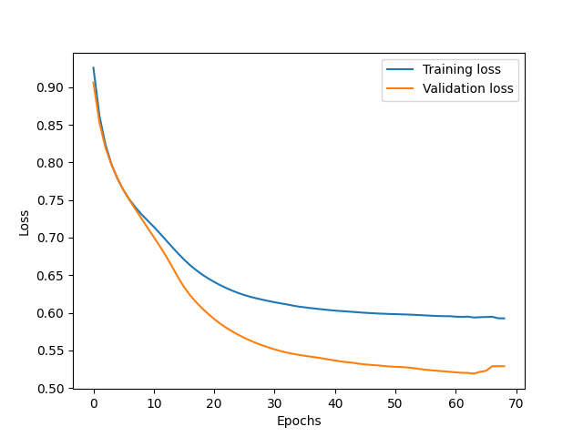

Q1.

Remark: I only ran the model for 100 epochs, which might not have been sufficient to reach its full potential. There's a possibility that with more epochs, the F1 score could improve, although this also raises concerns about overfitting, especially given the small size of the dataset.

Best F1 Score on valid data: 0.7847267461608596
Best Hyperparameters: {'learning_rate': 0.001, 'use_bias': True, 'early_stopping_rounds': 5}

(i)learning curves for the training and validation datasets

(ii)

Test Confusion Matrix:
| | Predicted Class 1 | Predicted Class 2 | Predicted Class 3 |
|----------|-------------------|-------------------|-------------------|
| Actual Class 1 | 39 | 8 | 1 |
| Actual Class 2 | 8 | 73 | 23 |
| Actual Class 3 | 0 | 10 | 38 |

Test F1 Score: 0.7522041467304625

(iii) Why Using a Neural Network on This Dataset is a Bad Idea
Using a neural network for this dataset poses several challenges:

1). Limited Data: The dataset contains only 2000 entries, each with just three features. Neural networks generally require a large amount of data to learn effectively. With such a small dataset, the network may not have enough information to generalize well, leading to poor performance on unseen data.

2).Data Imbalance: The dataset is imbalanced, meaning some classes are represented more than others. This imbalance can bias the neural network towards the overrepresented classes, resulting in poor classification performance for the underrepresented classes.

3). Complexity Overkill: Given the simplicity of the dataset (only three features per entry), using a neural network might be an overkill. Simpler models like logistic regression or decision trees might be more appropriate and could yield better or comparable results with less risk of overfitting.
4).Lack of Interpretability in Medical Context: In medical applications, the interpretability of a model is crucial. Neural networks, particularly complex ones, are often considered 'black boxes' due to their intricate structures and non-linear processing, making it challenging to understand their decision-making process. For a medical dataset with a limited number of features, a more interpretable model is preferable, as it not only potentially offers similar effectiveness but also provides critical insights into its decisions, enhancing trust and reliability in clinical settings.

(iv) Discussion of the Selected Hyper-Parameters and Their Impact
The chosen hyperparameters for the neural network were:

Learning Rate (0.001): A moderate learning rate was selected to balance between fast convergence and the risk of overshooting the minimum loss. A higher learning rate might have caused instability in learning, while a too-low rate could have led to slow convergence.

Use of Bias (True): Including bias terms in the network layers allows the model to better fit the data by shifting the activation functions, providing more flexibility. This choice can help the network learn more complex patterns, which is crucial given the small dataset.

Early Stopping Rounds (5): Early stopping was implemented to prevent overfitting, which is a common problem in neural networks, especially with limited data. By monitoring the validation loss and stopping the training process if it doesn't improve after 5 epochs, the model is less likely to overfit on the training data.

Q4. In one instance, I utilized PyTorch's ADAM optimizer, yielding the following results:
This resulted in a Validation F1 Score of 0.81977875.

For the Test Confusion Matrix, the results were:
[[55  3  0]
 [15 56 13]
 [ 0  4 54]]

leading to a Test F1 Score of 0.8082966914038343.

[[47  1  0]
 [15 77 12]
 [ 0 10 38]]

Subsequently, I decided to manually implement the ADAM optimizer in the neural network to compare the outcomes.
I examined the data imbalance and then implemented weighted classification. Additionally, I employed the tanh activation function and Xavier initialization. I manually wrote the ADAM optimizer. The final results were as follows:

Validation Confusion Matrix:
[[54  4  0]
 [ 7 73  4]
 [ 0  4 54]]

This resulted in a Validation F1 Score of 0.904829640947288.

Test Confusion Matrix:
​
[[46  2  0]
 [ 5 92  7]
 [ 0  6 42]]
leading to a Test F1 Score of 0.8998849624198322.

I re-implemented a 3-class classification feed-forward neural network, originally developed using PyTorch, but this time without PyTorch's built-in optimizer. Instead, I manually calculated gradients and applied them using a custom ADAM optimization algorithm.

Key Elements:

Bias Term Exclusion: Following assignment requirements, bias terms were omitted in the neural network layers, focusing solely on weight vectors and matrix operations.
Weight Initialization: Weights were initialized using the Xavier uniform method, suitable for tanh activation functions.
Activation Function: The tanh function was used for hidden layer activations, providing simplicity and effectiveness.
Gradient Calculation: Gradients were computed using backpropagation, involving matrix operations for loss derivative calculation.
Custom ADAM Implementation: The ADAM optimizer was manually implemented, including updates to the first and second moment estimates (m and v) for each weight. Standard ADAM parameters like learning rate, beta1, beta2, and epsilon were used.
Validation with PyTorch Optimizer: To validate my manual implementation, I compared weight matrices, pre- and post-update, against those from PyTorch's ADAM optimizer. This confirmed the effectiveness of my manual gradient calculation and ADAM implementation.

Weight Differences:
The differences in the first and second layer weights were tensor(3.3658) and tensor(4.4500), respectively. These values, indicating the Euclidean distances between the weights of my manual implementation and PyTorch's ADAM optimizer, suggest a moderate level of similarity. The discrepancies likely arise from minor variations in the ADAM implementation or numerical precision.
Despite these differences, the F1 results indicate that my manual implementation closely approximates PyTorch's optimizer behavior.
