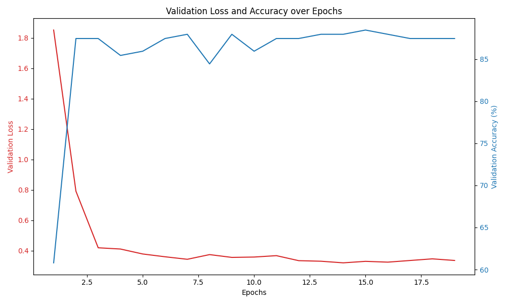
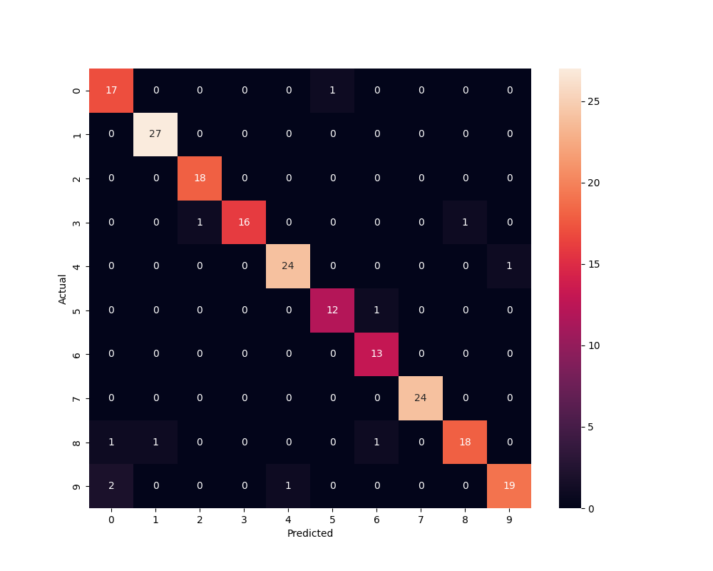

Implement neural network in PyTorch with an architecture of your choosing (a
deep feed-forward neural network is fine) to perform 10-class classification on the MNIST
dataset. Apply the same data transformations that you used for Homework #2. You are
encouraged to use a different optimizer and the cross-entropy loss function that comes with
PyTorch. Describe your design choices, provide a short rationale for each and explain how
this network differs from the one you implemented for Part 1. Compare your results to
Homework #2 and analyze why your results may be different. In addition, please provide
the learning curves and confusion matrix as described in Part 1.

In implementing a neural network for 10-class classification on the MNIST dataset using PyTorch, I chose a more complex architecture compared to my previous effort in Part 1. For this part, I developed a deeper feed-forward neural network with six layers. The first layer takes in 784 input features (flattened 28x28 pixel images) and outputs 1024 features, followed by batch normalization through BatchNorm1d. The subsequent layers (fc2 to fc5) further process these features, reducing the dimensionality step-by-step(from 1024 to 512, from 512 to 256, from 256 to 128, from 128 to 64) until reaching the final layer (fc6), which outputs 10 classes corresponding to the digits 0-9.

In the design of the neural network, I have chosen ELU (Exponential Linear Unit) as the activation function. The choice of ELU, rather than traditional functions like ReLU, is aimed at improving learning dynamics. ELU helps in reducing the vanishing gradient problem, a common issue in deep networks, by ensuring a smoother nonlinearity. This characteristic is particularly beneficial in deep architectures like the one implemented, with multiple hidden layers. Additionally, each layer, up to the penultimate one, incorporates batch normalization. This step is crucial for normalizing the input layer by adjusting and scaling activations. It helps in stabilizing and accelerating the training process, whilst also providing a form of regularization, which can improve the generalization of the model. This approach marks a significant difference from Part 1, where a custom sigmoid activation function was employed. By adopting ELU and batch normalization, the network is expected to learn more efficiently and effectively, addressing some of the limitations observed with the sigmoid activation in Part 1.

Regarding the optimizer, I experimented with Adam, SGD, and RMSprop. Among these, Adam consistently yielded the best results, likely due to its adaptive learning rate capabilities. Additionally, the network employs cross-entropy loss, a standard choice for multi-class classification problems like MNIST. That's also the part different from Part 1, Part 1 used SGD optimizer and softmax function.

The training was further enhanced by the implementation of a learning rate scheduler and early stopping. The scheduler adjusts the learning rate based on the validation loss, potentially leading to better convergence, while early stopping prevents overfitting by terminating training when the validation loss ceases to decrease.

When comparing the results to Homework #2, there is a notable improvement in accuracy, reaching around 88% to 94%. This increase can be attributed to several key factors:

Complexity and Learning Mechanism: KNN is a simple algorithm that classifies data based on the closest training examples, while K-Means clusters data without learning underlying patterns. In contrast, a neural network is more complex, capable of learning hierarchical patterns through its multiple layers and nonlinear activations. This advanced learning mechanism allows neural networks to better understand and classify complex data like MNIST images.

Handling High-Dimensional Data: KNN and K-Means, while effective for certain types of data, struggle with the high dimensionality and complexity of image data. They don't inherently process spatial hierarchies or patterns in pixels. Neural networks, however, excel in processing and learning from image data due to their ability to capture and model intricate relationships in high-dimensional spaces.

Accuracy and Generalization: Neural networks, because of their sophisticated learning abilities, generally achieve higher accuracy and better generalization on complex tasks like image classification. This leads to improved performance on datasets like MNIST, as compared to simpler methods like KNN and K-Means.

learning curves for part 2:

confusion matrix for part 2:

