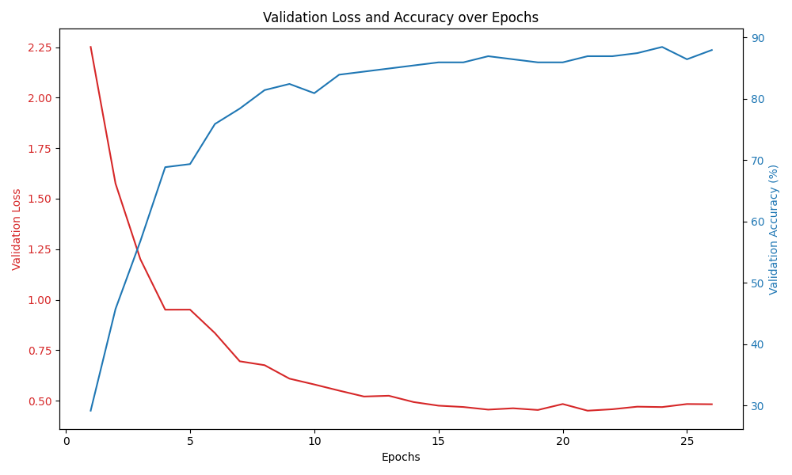
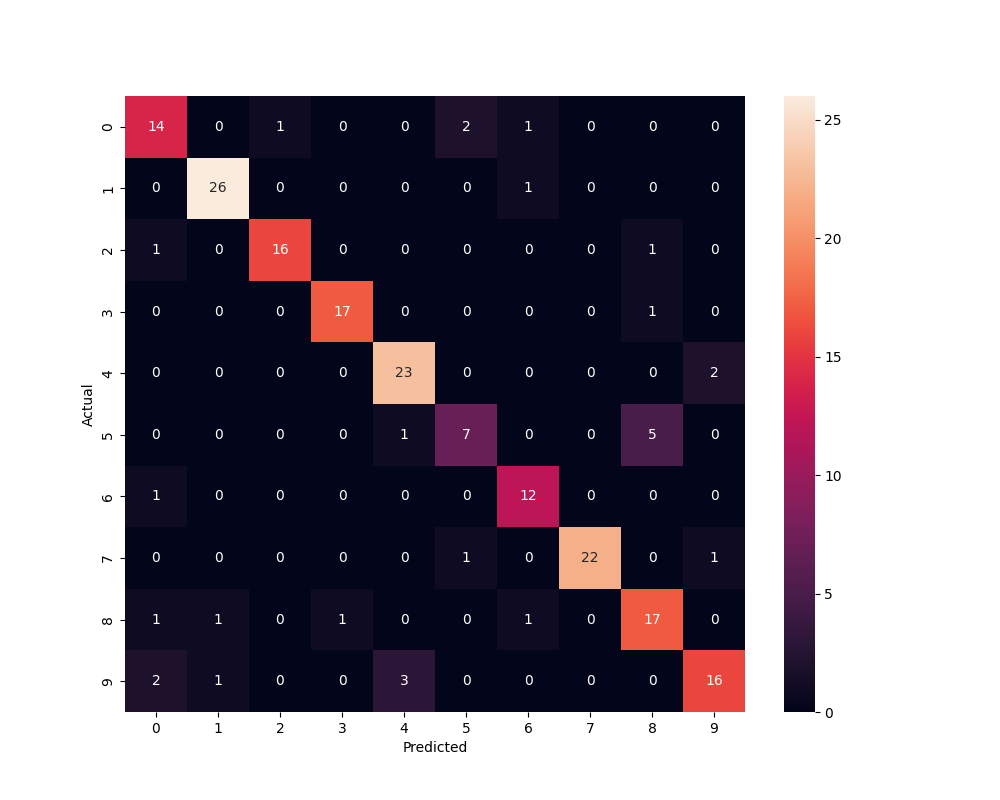

Add a regularizer of you choice to the 10-class classifier that you implemented
for Part 2. Describe your regularization, the motivation for your choice and analyze the
impact of the performance of the classifier. This analysis should include a comparison of
learning curves and performance.

- In the enhanced version of the 10-class classifier for the MNIST dataset, I incorporated two key regularization techniques: L2 regularization (weight decay) and dropout. These changes were made to improve the model's generalization capabilities and mitigate overfitting.

- Dropout: we added dropout layers with a rate of 0.2 after the first and second fully connected layers. Dropout randomly ignores a fraction of neurons during training, which helps in preventing the network from becoming overly dependent on specific neuron paths, thereby enhancing its ability to generalize.

- L2 Regularization: This was integrated via the weight_decay parameter in the Adam optimizer. L2 regularization penalizes large weights, encouraging the model to find simpler patterns, which often generalize better.
  Impact on Performance

- These regularization techniques likely led to reduced overfitting. By discouraging the model from learning overly complex patterns specific to the training data, the model becomes more robust to unseen data. The accuracy observed was around 84-86%, which is slightly lower than a non-regularized model. This is a common trade-off in regularization, where the model sacrifices some degree of training accuracy for better generalization.

learning curves for reg model:

confusion matrix for reg model:

- With Regularization:

  - The learning curve, indicative of a model with regularization, shows a smoother decline in validation loss over epochs compared to the non-regularized model. The validation accuracy increases steadily, plateauing around the 80% mark.

- Without Regularization:

  - The learning curve, from the non-regularized model, demonstrates a steeper decline in validation loss initially, leveling off as the epochs increase. The validation accuracy in this case peaks higher than the regularized model, surpassing the 86% mark. This suggests that without the constraints of regularization, the model is more free to fit the training data closely, which can lead to higher accuracy on the validation set, but also raises concerns about potential overfitting.

- Comparison and Performance:

Comparatively, the regularized model shows signs of better generalization, evidenced by the less erratic and more generalized decline in validation loss. The non-regularized model, while achieving higher accuracy, may be overfitting to the training data, as indicated by the sharper fluctuations in validation accuracy.

The performance trade-off here is between the higher but potentially overfitted accuracy of the non-regularized model and the more robust, generalizable accuracy of the regularized model. The choice between the two approaches would depend on the desired balance between fitting the training data and generalizing well to unseen data.
